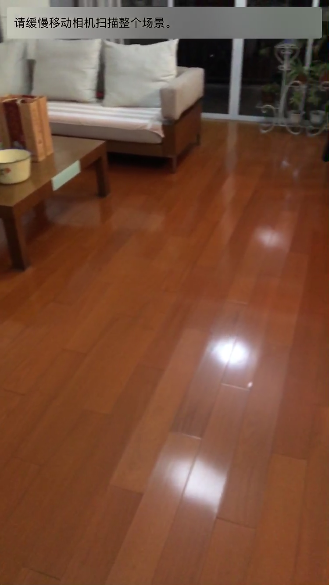
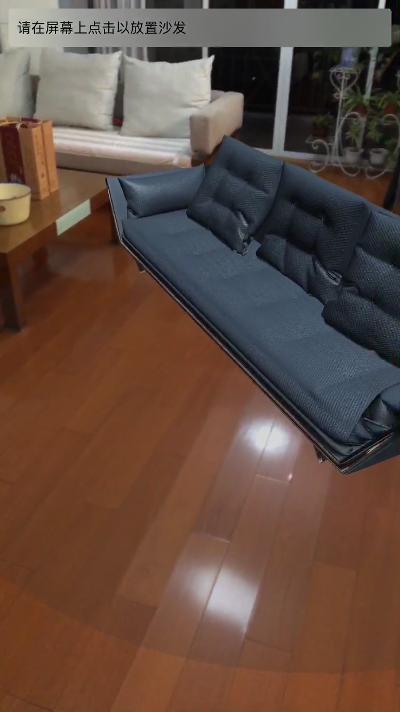
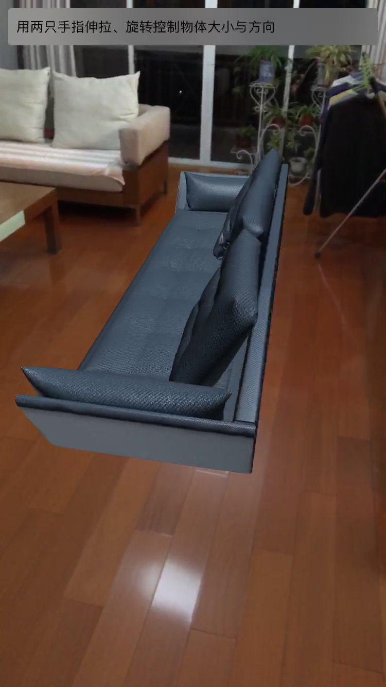
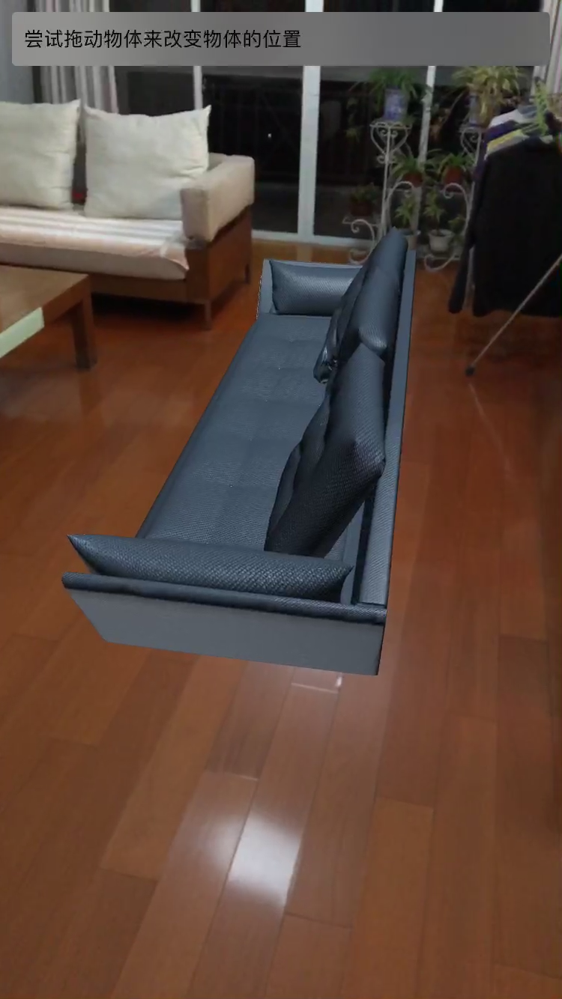
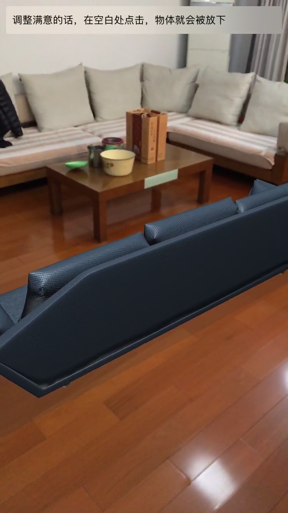
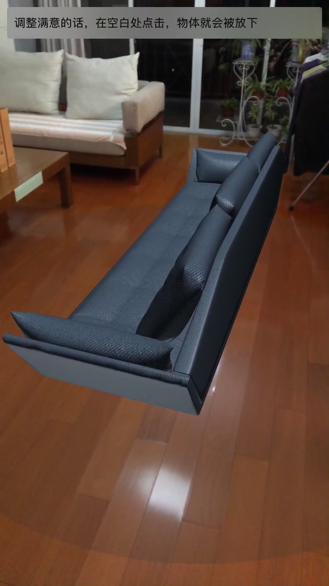
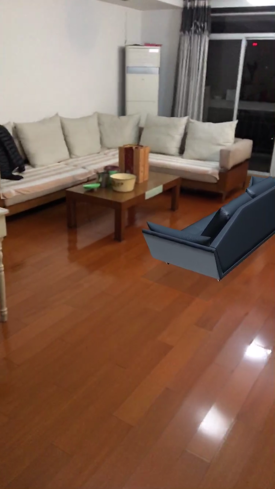
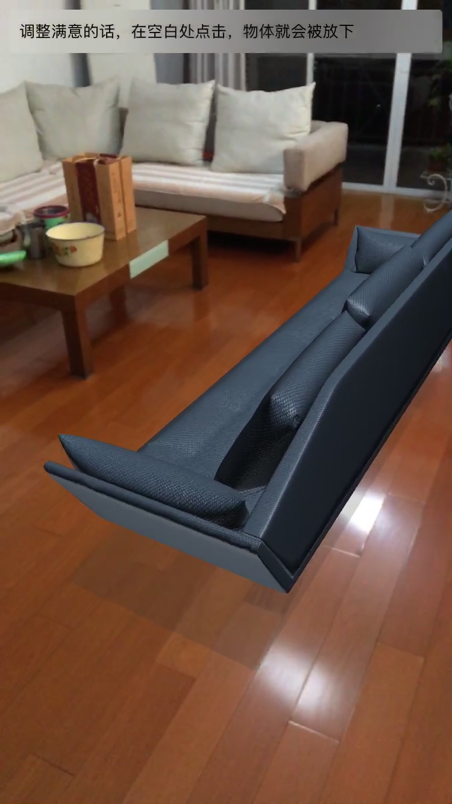
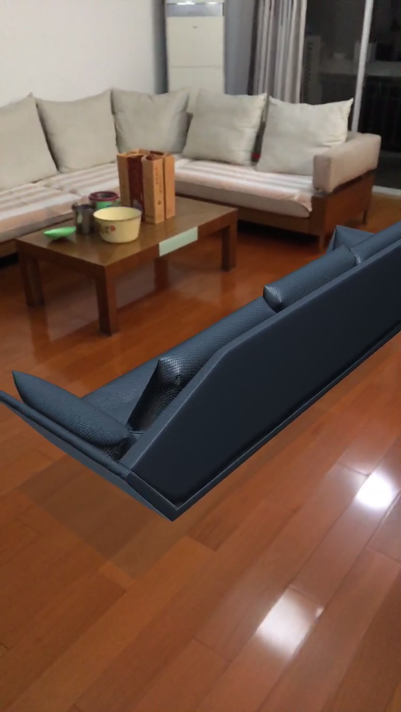
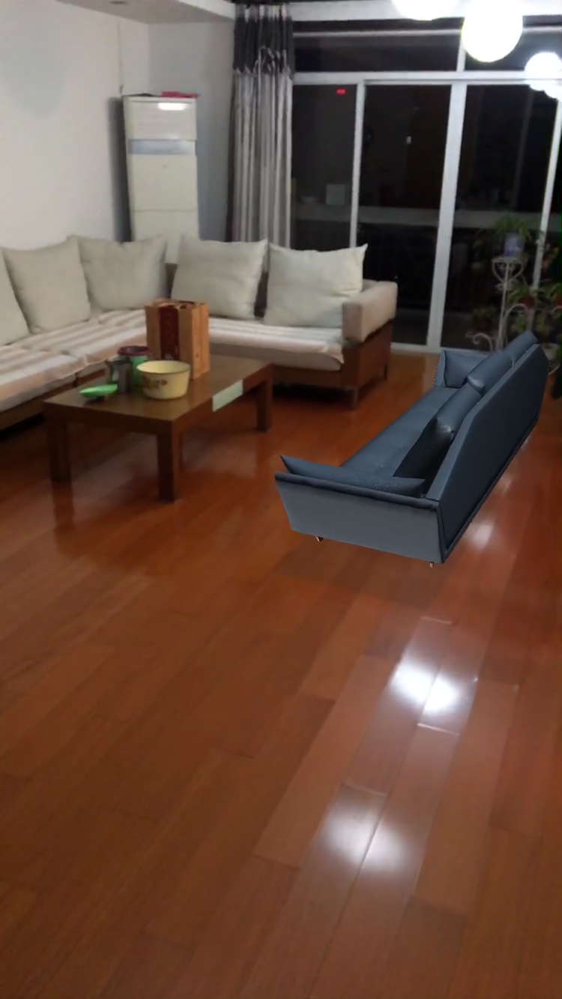

# SwiftGL-ARKit-iDecorator

> Swift 4+OpenGL ES 3+ARKit Demo

## Some Features

- Optimized plane estimation
- Smooth transition
- Enhanced lighting
- Multiple Gesture Recognizer Support
- ARKit adoption with OpenGL ES 3 + Swift (one of the earliest)

## Preview

#### Images

#### Video

- [YouTube](https://www.youtube.com/watch?v=BxgXeTcIDvI)